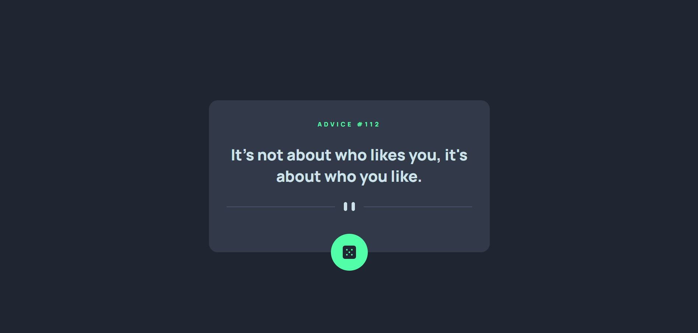

# Frontend Mentor - Advice generator app solution

This is a solution to the [Advice generator app challenge on Frontend Mentor](https://www.frontendmentor.io/challenges/advice-generator-app-QdUG-13db). Frontend Mentor challenges help you improve your coding skills by building realistic projects.

## Table of contents

- [Overview](#overview)
  - [The challenge](#the-challenge)
  - [Screenshot](#screenshot)
  - [Links](#links)
- [My process](#my-process)
  - [Built with](#built-with)
  - [What I learned](#what-i-learned)
  - [Continued development](#continued-development)
  - [Useful resources](#useful-resources)
- [Author](#author)

## Overview

### The challenge

Users should be able to:

- View the optimal layout for the app depending on their device's screen size
- See hover states for all interactive elements on the page
- Generate a new piece of advice by clicking the dice icon

### Screenshot

### Links

- Solution URL: [Advice Generator](https://fm03-advice-generator.vercel.app/)

## My process

### Built with

- Semantic HTML5 markup
- CSS custom properties
- Flexbox
- [React](https://reactjs.org/) - JS library
- [Axios](https://axios-http.com/) - Promise based HTTP client for the browser and node.js

### What I learned

I this project I learned how to use useEffect() in React and how to fetch data from an API using Axios.

### Continued development

In future projects I want to continue focusing on React and Axios, I need more practice to become proficient with these tools.

### Useful resources

- [Animista](https://animista.net/) - On-demand CSS Animation Library.
## Author

- Frontend Mentor - [@dunaidan](https://www.frontendmentor.io/profile/dunaidan)
- Linkedin - [@dandunai](https://www.linkedin.com/in/dandunai/)